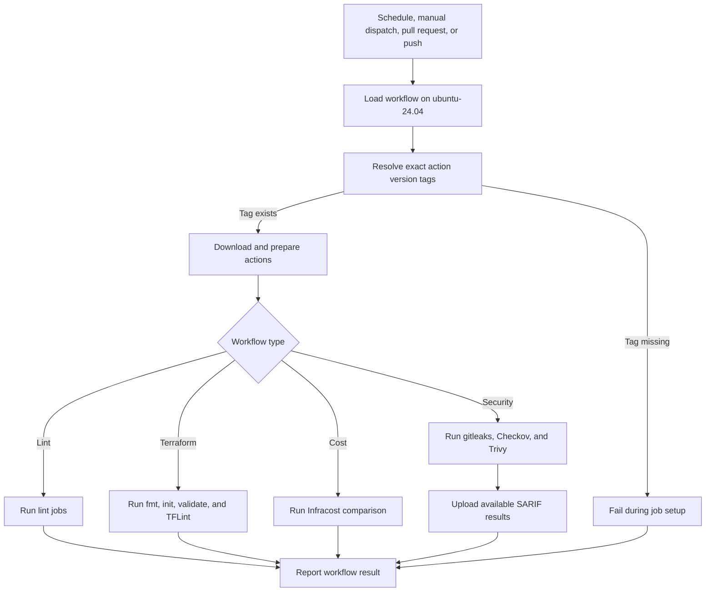

# GitHub Actions version resolution flow

```mermaid
flowchart TD
    trigger[Schedule, manual dispatch, pull request, or push] --> load[Load workflow on ubuntu-24.04]
    load --> resolve[Resolve exact action version tags]
    resolve -->|Tag exists| prepare[Download and prepare actions]
    resolve -->|Tag missing| setupFail[Fail during job setup]
    prepare --> scan{Workflow type}
    scan -->|Lint| lint[Run lint jobs]
    scan -->|Security| security[Run gitleaks, Checkov, and Trivy]
    scan -->|Terraform| terraform[Run fmt, init, validate, and TFLint]
    scan -->|Cost| cost[Run Infracost comparison]
    security --> sarif[Upload available SARIF results]
    lint --> result[Report workflow result]
    terraform --> result
    cost --> result
    sarif --> result
    setupFail --> result
```
